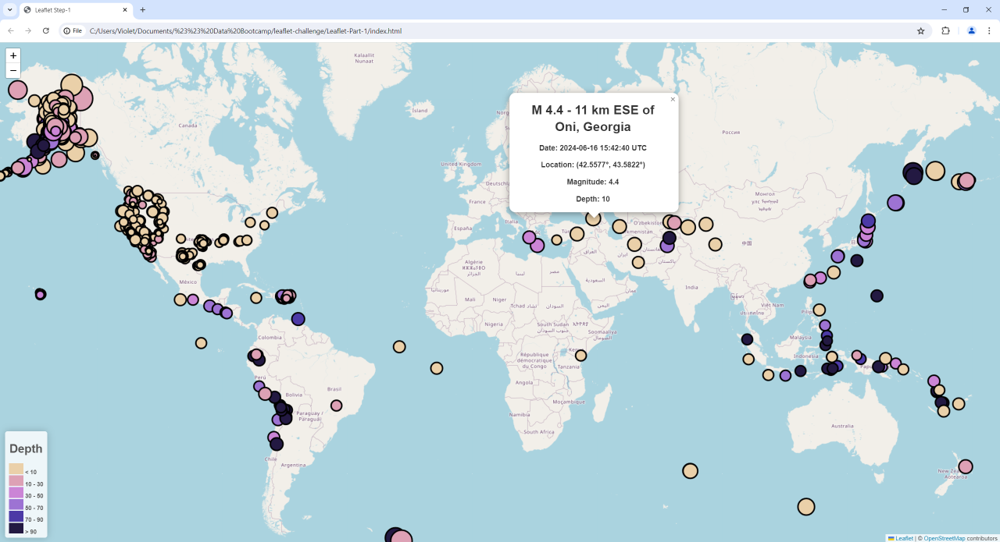

# leaflet-challenge
Violet Bui - Data Bootcamp - Module 15 challenge

## Project
A webpage showing information on global earthquakes in the past 7 days to aid the United States Geological Survey (USGS) educate the public and other goverment organisations.

## Resources:
Earthquake data sourced from:

- <u>[USGS Earthquake Data](https://earthquake.usgs.gov/earthquakes/feed/v1.0/geojson.php)</u>
- <u>[All Earthquakes (Past 7 days)](https://earthquake.usgs.gov/earthquakes/feed/v1.0/summary/all_week.geojson)</u>

## Part 1: Earthquake visualisation
<b><u>/Leaflet-Part-1/index.html</u></b>    
- Webpage showing global map of earthquakes  
- Earthquakes are denoted by circle:  
> Colour of circle represents the depth the earthquake occurred at  
Size of circle represents the magnitude of the earthquake (Negative magnitudes are shown as size 0)  

<i>The view of the map depends on the screen resolution and size of the screen it is being viewed on. This is the view as seen on my screen:</i>  

<b><u>/Leaflet-Part-1/css/style.css</u></b>   
- Style sheet

<b><u>/Leaflet-Part-1/js/logic.js</u></b>   
- Logic for map
> Map creation  
Legend creation  
Circle marker logic
